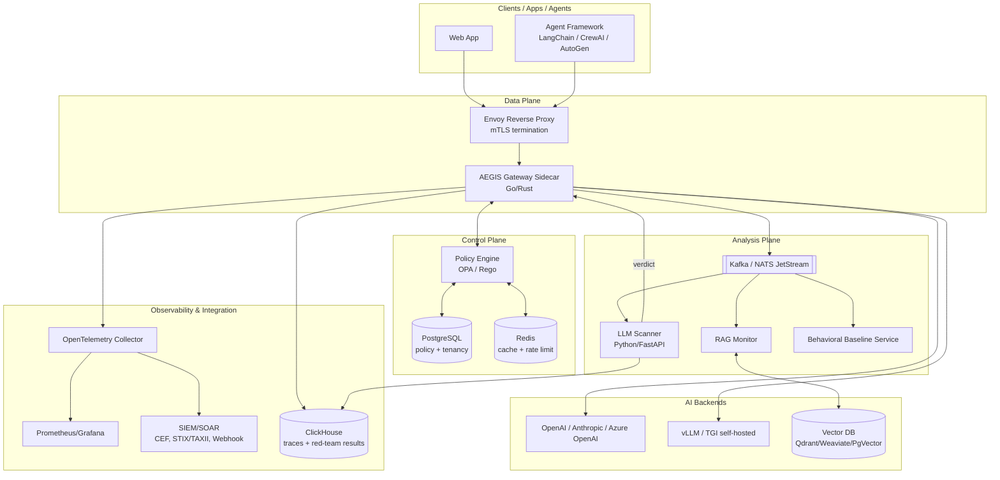
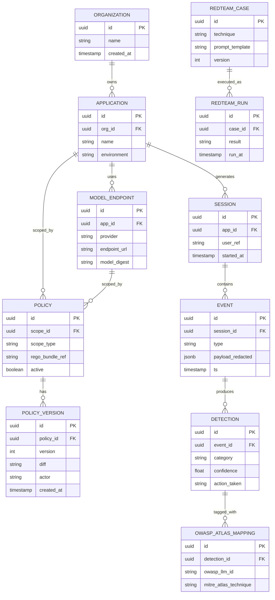
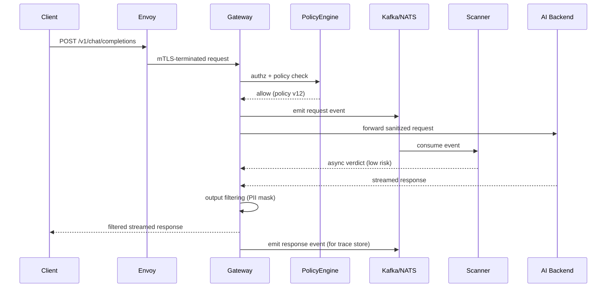
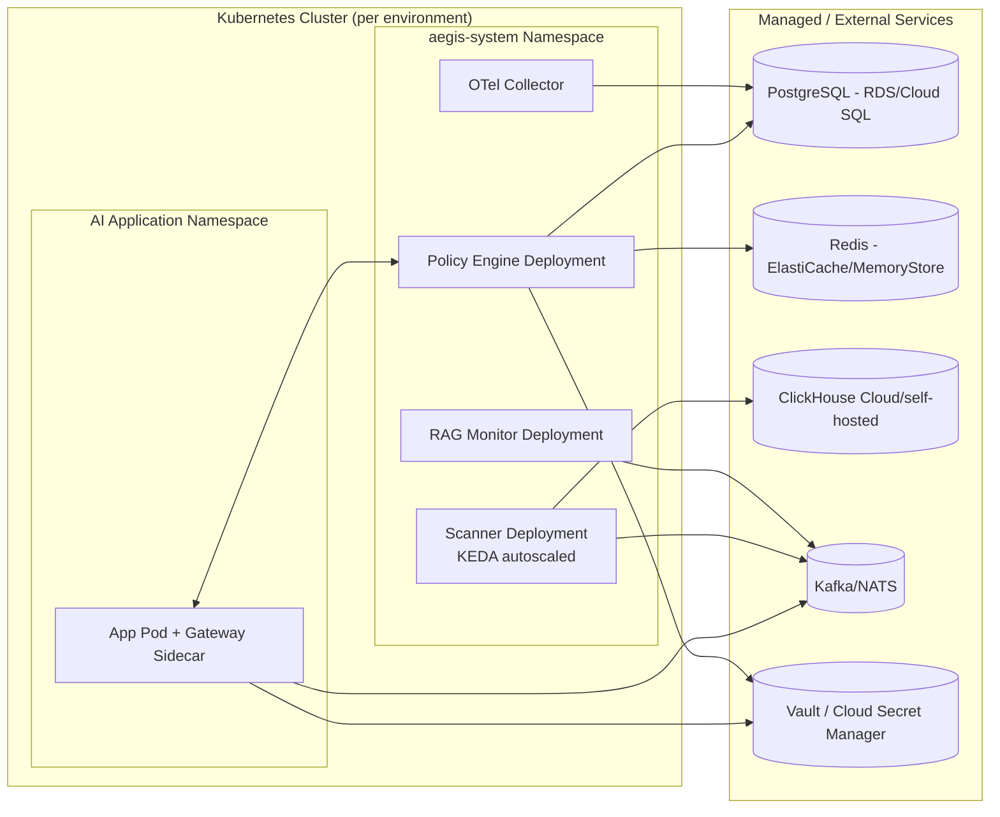

# AEGIS — Software Architecture Document

**Related docs:** `prd.md`, `rules.md`, `phases.md`, `design.md`, `memory.md`

---

## 1. High-Level Architecture

AEGIS is a **cloud-native, event-driven, sidecar-based runtime security gateway**. It has four planes:

1. **Data plane** — Envoy ingress + AEGIS Gateway sidecar, which proxies and enforces policy on every AI request/response in-line.
2. **Control plane** — Policy Engine (OPA/Rego) + tenancy/config store, which pushes policy to the data plane.
3. **Analysis plane** — LLM Scanner, RAG Monitor, and behavioral-baseline services, consuming events asynchronously off a message bus to produce verdicts.
4. **Observability & integration plane** — telemetry pipeline, SIEM/SOAR export, compliance reporting, red-team harness.



## 2. System Overview

| Plane | Responsibility | Key components |
|---|---|---|
| Data plane | In-line proxy, identity validation, policy enforcement | Envoy, Gateway sidecar |
| Control plane | Policy storage, tenancy hierarchy, distribution | Policy Engine (OPA), PostgreSQL, Redis |
| Analysis plane | Async detection: injection/jailbreak, RAG poisoning, behavioral anomalies | LLM Scanner, RAG Monitor, Baseline service, Kafka/NATS |
| Observability & integration | Metrics/traces/logs, SIEM/SOAR export, compliance, red-team | OTel Collector, Prometheus/Grafana, Loki, ClickHouse, red-team harness |

**Design principle:** the data plane never blocks on the full analysis plane for latency-sensitive paths. Fast, synchronous checks (auth, input sanitization, prompt-structure guardrails, tool-allowlisting) happen inline in the Gateway sidecar. Slower, deeper checks (LLM ensemble scanning, RAG anomaly detection) happen asynchronously and can operate in **tag-and-allow** or **block-pending-verdict** mode depending on policy risk tier.

## 3. Folder Structure

```
aegis/
├── apps/
│   ├── gateway/                 # Go (or Rust) sidecar — data plane
│   │   ├── cmd/
│   │   ├── internal/
│   │   │   ├── proxy/
│   │   │   ├── auth/
│   │   │   ├── sanitize/
│   │   │   ├── policyclient/
│   │   │   └── telemetry/
│   │   └── go.mod
│   ├── scanner/                 # Python/FastAPI — LLM ensemble scanner
│   │   ├── app/
│   │   │   ├── api/
│   │   │   ├── ensemble/
│   │   │   ├── models/
│   │   │   └── evaluators/
│   │   └── pyproject.toml
│   ├── rag-monitor/             # Python — RAG poisoning/anomaly detection
│   │   ├── app/
│   │   └── pyproject.toml
│   ├── policy-engine/           # OPA + control-plane API (Go)
│   │   ├── rego/
│   │   ├── api/
│   │   └── go.mod
│   ├── redteam/                 # Adversarial test harness + registry
│   │   ├── generators/
│   │   ├── testcases/           # versioned red-team registry
│   │   └── runner/
│   └── ui/                      # React/TypeScript SOC dashboard
│       ├── src/
│       │   ├── components/
│       │   ├── pages/
│       │   ├── hooks/
│       │   └── lib/
│       └── package.json
├── packages/                    # shared libraries across apps
│   ├── proto/                   # gRPC/protobuf contracts
│   ├── owasp-atlas-mappings/    # shared taxonomy mapping data
│   └── sdk-js/ sdk-python/      # optional SDK-based integration
├── deploy/
│   ├── helm/
│   │   ├── aegis-gateway/
│   │   ├── aegis-scanner/
│   │   └── aegis-control-plane/
│   ├── terraform/
│   │   ├── aws/ gcp/ azure/
│   └── envoy/
├── infra/
│   ├── ci/                      # GitHub Actions / GitLab CI configs
│   └── policies/                # default Rego policy bundles
├── docs/                        # prd.md, architecture.md, rules.md, phases.md, design.md, memory.md
└── tests/
    ├── unit/
    ├── integration/
    └── e2e/
```

**Assumption [ASSUMPTION]:** monorepo structure (`apps/` + `packages/`) is chosen over polyrepo for MVP simplicity given the small-team constraint noted in `prd.md`; can be split into polyrepo later without changing internal module boundaries.

## 4. Technology Stack

| Layer | Technology | Rationale |
|---|---|---|
| Ingress proxy | Envoy (alt: Caddy) | Industry-standard L7 proxy, xDS dynamic config, mTLS support |
| Gateway sidecar | Go (primary), Rust (latency-critical path optional) | Low-latency proxying, strong concurrency primitives |
| Scanner / RAG monitor | Python 3.12 + FastAPI | Best ecosystem for ML/LLM tooling (vLLM, HF, scikit-learn) |
| Policy engine | Open Policy Agent (OPA) + Rego | Declarative policy-as-code, CNCF-standard |
| Frontend | React + TypeScript, Grafana (embedded panels) | Component ecosystem + existing observability tooling reuse |
| Relational store | PostgreSQL | Policy, tenancy, config — strong consistency needs |
| Time-series/analytics store | ClickHouse | High-ingest columnar store for traces & red-team results |
| Cache / rate limiting | Redis | Low-latency policy cache, distributed rate limiting |
| Message bus | Kafka (alt: NATS JetStream) | Decouples Gateway from Scanner/RAG Monitor/exporters |
| Vector DB (monitored, not owned) | Qdrant / Weaviate / PgVector | RAG backend under monitoring, not part of AEGIS core storage |
| Identity | Keycloak or Ory Hydra (OAuth2/OIDC), SPIFFE/SPIRE (workload identity) | Standards-based auth, avoids vendor lock-in |
| Containers | Docker, distroless base images | Minimal attack surface |
| Orchestration | Kubernetes (EKS/GKE/AKS) | Portable multi-cloud target |
| IaC | Terraform + Helm + Kustomize | Declarative, GitOps-compatible |
| CI/CD | GitHub Actions / GitLab CI + SLSA L2+ | Signed, provenance-tracked builds |
| Observability | OpenTelemetry Collector, Prometheus, Grafana, Tempo/Jaeger, Loki | Standard, vendor-neutral telemetry |
| Local LLM inference | vLLM / TGI, open models (Llama, Mistral) | Cost control + data residency for the scanner itself |
| Supply chain security | Sigstore/Cosign, Trivy/Grype, CycloneDX SBOM | Signed builds, vulnerability scanning, SBOM/VEX |

## 5. Frontend Architecture

- **Framework:** React + TypeScript (Vite build).
- **Structure:** feature-folder pattern (`pages/`, `components/`, `hooks/`, `lib/`) — see `rules.md §Folder Conventions`.
- **State management:** React Query (server state / cache for API data) + lightweight local state (Zustand) for UI-only state. No Redux — unnecessary complexity for this scope. **[ASSUMPTION]**
- **Visualization:** Grafana panels embedded via iframe/API for time-series metrics; custom React components for the session trace explorer/timeline replay (bespoke UX, not generic dashboarding).
- **Auth:** OIDC via Keycloak/Hydra, token stored in memory (not localStorage) with silent refresh.
- **Design system:** see `design.md`.

## 6. Backend Architecture

### 6.1 Gateway Sidecar (data plane)
- Terminates the enforcement pipeline per request: **Auth → Input Sanitization → Policy Check → Proxy to backend → Output Filtering → Response**.
- Streaming (SSE) requests are enforced in chunks: each chunk passes through fast synchronous checks; async scanner verdicts can trigger mid-stream truncation for high-risk policies.
- Emits every request/response event to the message bus for the analysis plane.
- Caches resolved policy locally (last-known-good) to tolerate control-plane unavailability.

### 6.2 Policy Engine (control plane)
- OPA embedded or sidecar-deployed, evaluating Rego policies compiled from a hierarchical model (org → app → model → environment).
- Policy CRUD API backed by PostgreSQL; changes are versioned and audit-logged.
- Distribution to Gateway replicas via gRPC streaming or long-poll; Redis used for fast policy-cache lookups.

### 6.3 LLM Scanner (analysis plane)
- Dual-model ensemble: two independent LLMs (e.g., two different open-weight models via vLLM) independently classify a prompt/response for injection/jailbreak signals.
- On disagreement, verdict escalates to "needs review" (tag-and-hold or tag-and-allow per policy) rather than silently picking one model's answer.
- Autoscaled via KEDA based on Kafka/NATS consumer-group lag (queue depth).

### 6.4 RAG Monitor
- Subscribes to retrieval events; computes embedding-neighborhood anomaly scores and tracks citation/retrieval-distribution drift over time (online changepoint detection).
- Flags candidate RAG-poisoning events to the bus for triage.

### 6.5 Behavioral Baseline Service
- Maintains per-user/per-app online-learned baselines (sequence length, tool-call sequences, time-of-day, error rate).
- Emits anomaly scores as additional signal input to the overall verdict, not a sole decision-maker.

## 7. Database Design



**Storage split rationale:**
- **PostgreSQL** — normalized, low-volume, strongly-consistent data: orgs, applications, policies, policy versions, red-team case definitions.
- **ClickHouse** — high-volume, append-mostly, time-series data: session/event traces, detection records, red-team run results. Queried for the trace explorer and analytics dashboards.
- **Redis** — ephemeral: resolved-policy cache, rate-limit counters, distributed locks for leader election across gateway replicas.

## 8. Authentication

- **External/user-facing:** OAuth2/OIDC via Keycloak or Ory Hydra. Supports MFA at the IdP layer.
- **Service-to-service (east-west):** SPIFFE/SPIRE-issued workload identity (SVIDs), enforced via mTLS at the Envoy layer.
- **API keys** (for programmatic/legacy client integration) are supported but discouraged in docs as a secondary path; must be scoped, rotatable, and stored hashed.
- **Secret Zero bootstrap:** initial gateway credentials are obtained via Kubernetes ServiceAccount token federation into cloud IAM (IRSA on AWS, Workload Identity on GCP) or Vault's Kubernetes auth method — no static long-lived secret is baked into images.

## 9. Authorization

- **Model:** hybrid RBAC + ABAC.
  - RBAC for coarse product roles (Admin, Security Analyst, Auditor/Read-only, App Owner).
  - ABAC (via OPA/Rego) for fine-grained, contextual decisions: e.g., "App Owners may edit policy only for applications they own," or "block if request originates outside allowed IP range AND targets a production model endpoint."
- **Policy hierarchy resolution order:** environment-level override → model-level → application-level → organization-level default (most specific wins).
- All authorization decisions are logged with the evaluated policy version for auditability.

## 10. API Architecture

- **External-facing (proxied AI traffic):** transparent reverse-proxy pass-through preserving each backend's native API shape (`/v1/chat/completions`, `/v1/embeddings`, agent/tool endpoints) — no client-side SDK changes required for basic protection.
- **AEGIS management API:** REST + gRPC.
  - REST (JSON) for the SOC dashboard/UI and external integrations (policy CRUD, detections query, compliance report generation).
  - gRPC for internal control-plane ↔ data-plane policy distribution (low-latency, streaming-capable).
- **Versioning:** URI-based versioning for REST (`/api/v1/...`); protobuf schema evolution (backward-compatible field addition only) for gRPC.
- **Rate limiting:** token-bucket at the Envoy/Gateway layer, state coordinated via Redis.



## 11. State Management

- **Data plane:** stateless request handling; per-session state (multi-turn tracking) held in Redis with TTL, keyed by session ID, to support distributed gateway replicas without sticky sessions.
- **Control plane:** policy state is the source of truth in PostgreSQL; Redis is a cache only (cache-invalidation on write via pub/sub).
- **Frontend:** server state cached via React Query; no client-side duplication of source-of-truth data.

## 12. Caching Strategy

| Cached data | Store | TTL / invalidation |
|---|---|---|
| Resolved policy bundles | Redis (local to gateway pod optionally via in-memory L1 + Redis L2) | Invalidated via pub/sub on policy write; fallback max-TTL 5 min |
| Rate-limit counters | Redis | Sliding window, per-key TTL |
| Session/multi-turn context pointers | Redis | TTL matched to session inactivity timeout (configurable, default 30 min) |
| Behavioral baselines (hot subset) | In-process cache in Baseline service, backed by ClickHouse for cold data | Refreshed on rolling window basis |

## 13. File Storage

- Red-team test case definitions and policy Rego bundles: stored in Git (source of truth), synced to an object store (S3/GCS/Azure Blob) for runtime distribution artifacts (signed bundles).
- Compliance evidence bundles (generated PDFs/JSON): object storage, encrypted at rest, retention policy configurable per tenant.
- No raw model weights are stored by AEGIS itself beyond digests/provenance metadata (weights are hosted by the inference layer, e.g., vLLM's own storage).

## 14. Logging

- **Structured logging** (JSON) across all services, correlation ID propagated from Envoy through Gateway, Scanner, RAG Monitor.
- Pipeline: Fluent Bit/Fluentd → Loki, with optional SIEM forwarding.
- **Redaction-by-default:** logs never contain raw prompt/response bodies unless explicitly enabled per tenant policy (privacy-by-default); trace bodies live in ClickHouse with field-level redaction rules, access-controlled separately from general logs.

## 15. Error Handling

- Distinguish explicitly between: **(a)** upstream AI provider errors, **(b)** AEGIS policy blocks, **(c)** AEGIS internal errors.
- Each surfaces a distinct, documented error code/shape to the caller (see `rules.md §API Standards`) so client applications can react appropriately (e.g., retry vs. fix-the-prompt vs. alert-on-call).
- Policy blocks always include: policy ID, rule reference, and (configurable) a human-readable reason — balancing developer experience against not leaking exact detection heuristics to a potential attacker.
- Analysis-plane failures (scanner/RAG monitor down) degrade gracefully per configured fail-open/fail-closed policy (see `prd.md §16 Assumptions`), never crash the data plane.

## 16. Security Considerations

- Zero Trust posture: every hop (client→Envoy, Envoy→Gateway, Gateway→backend, Gateway→bus, service→service) is authenticated and encrypted (mTLS/SPIFFE).
- Distroless, signed (Sigstore/Cosign), SBOM-tracked (CycloneDX/VEX) container images; SLSA L2+ build provenance.
- Scanner isolation: user-controlled input is never concatenated into the scanner's own system-level instructions without structural separation, to reduce meta-injection risk against the scanner itself.
- Principle of least privilege for all workload identities (per-service Kubernetes RBAC + cloud IAM scoping).
- Optional eBPF-based runtime anomaly detection (Falco integration) for the underlying node/container layer, complementary to AI-layer detection.
- Secrets never baked into images or env vars in plaintext; sourced from Vault/cloud secret managers at runtime.

## 17. Scalability

- Gateway sidecars scale horizontally with the AI workload pods they accompany (1:1 sidecar pattern).
- Scanner and RAG Monitor scale independently via KEDA, keyed on Kafka/NATS consumer lag — decoupling detection throughput from proxy throughput.
- ClickHouse scales via sharding/replication for high-volume trace ingestion.
- Policy Engine reads are cache-served (Redis) to avoid PostgreSQL becoming a bottleneck on the hot path; writes are low-frequency (policy changes), so PostgreSQL write load is not a scaling concern at expected volumes.

## 18. Performance Strategy

- Synchronous (blocking) checks in the Gateway limited to sub-10ms operations: auth validation (cached JWKS), local policy-cache lookup, structural guardrail checks, tool-allowlist lookup.
- Deep LLM-based scanning is asynchronous by default; only escalated to synchronous/blocking for the highest-risk policy tiers (e.g., production financial/health-data applications), a documented latency/safety trade-off (see `prd.md §16`).
- Streaming responses enforced via chunked inspection, avoiding full-buffering of large completions.
- Load testing gate in CI/CD (see `rules.md §Testing Standards`) enforces the p95 latency budget defined in `prd.md §10`.

## 19. Deployment Architecture



- Delivered via Helm charts per component (`aegis-gateway`, `aegis-control-plane`, `aegis-scanner`), composed by an umbrella chart for full-stack install.
- Terraform modules provision cloud-managed dependencies (RDS/Cloud SQL, ElastiCache/MemoryStore, managed Kafka, IAM roles) per cloud provider (`deploy/terraform/aws|gcp|azure`).
- GitOps-compatible: Helm values and Rego policy bundles are version-controlled; deployment via ArgoCD/Flux is supported, not required.

## 20. Environment Variables

**[ASSUMPTION]** — naming convention standardized as `AEGIS_<COMPONENT>_<SETTING>`; exact list will expand during implementation. Baseline set:

| Variable | Component | Purpose |
|---|---|---|
| `AEGIS_GATEWAY_LISTEN_ADDR` | Gateway | Bind address/port |
| `AEGIS_GATEWAY_POLICY_ENGINE_ADDR` | Gateway | gRPC address of policy engine |
| `AEGIS_GATEWAY_FAIL_MODE` | Gateway | `open` \| `closed` default fail behavior |
| `AEGIS_POLICY_DB_DSN` | Policy Engine | PostgreSQL connection string (sourced from Vault, not literal) |
| `AEGIS_POLICY_REDIS_ADDR` | Policy Engine | Redis address |
| `AEGIS_SCANNER_MODEL_A` / `AEGIS_SCANNER_MODEL_B` | Scanner | Identifiers of the two ensemble models |
| `AEGIS_BUS_BROKERS` | All analysis-plane services | Kafka/NATS broker list |
| `AEGIS_OTEL_EXPORTER_ENDPOINT` | All services | OTLP collector endpoint |
| `AEGIS_SIEM_CEF_ENDPOINT` | Gateway/exporter | Syslog/CEF target |
| `AEGIS_VAULT_ADDR` / `AEGIS_VAULT_ROLE` | All services | Secret backend bootstrap |

All secret-bearing variables are injected at runtime by the secret backend integration, never committed to config files or Helm values in plaintext.

## 21. CI/CD Considerations

- Pipeline stages: **lint → unit test → build (multi-arch, distroless) → SBOM generation (CycloneDX) → vulnerability scan (Trivy/Grype) → sign (Cosign) → integration test (ephemeral k8s/kind) → policy tests (OPA test) → push to registry → deploy (staging via GitOps) → e2e/red-team smoke suite → promote to prod (manual/approval gate)**.
- SLSA provenance attached to build artifacts; deployment tooling verifies signatures before rollout (admission-controller policy, e.g., Kyverno/Sigstore policy-controller).
- Rego policy changes go through the same PR review + automated `opa test` gate as application code (policy-as-code discipline — see `rules.md`).

## 22. Future Extensibility

- **Pluggable detector interface:** new detection modules (e.g., a future audio/multimodal-injection detector) register against the same event bus contract without core Gateway changes.
- **Provider adapter pattern:** new AI backend providers added via an adapter implementing a common upstream interface, isolating provider-specific quirks (auth headers, streaming format) from core enforcement logic.
- **Policy marketplace-ready:** Rego policy bundles are already versioned, signed artifacts — a natural foundation for the future policy-marketplace vision in `prd.md §17`.
- **Multi-modal readiness:** event schema on the bus includes a `modality` field from day one (even if only `text` is populated in MVP) to avoid a breaking schema change when image/audio inputs are added later.
